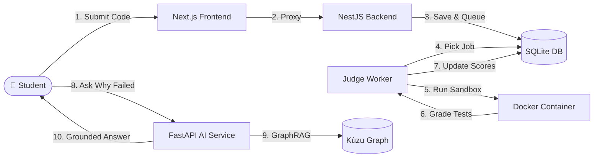

<div align="center">

# 🚀 Shodh-a-Code
### A Containerized Coding Contest Platform with an Evidence-Grounded AI Tutor
A practical, full-stack platform built for the **Shodh AI Engineer Intern Take-Home**.

<br />

# [http://ec2-13-206-201-211.ap-south-1.compute.amazonaws.com:3001/](http://ec2-13-206-201-211.ap-south-1.compute.amazonaws.com:3001/)
*Click above to experience the live platform*

<br />

• [Quick Start](#-quick-start-3-steps) • [How It Works](#-how-it-works) • [The 4 Stages](#-the-4-stages) • [AI Q&A Demo](#-the-3-ai-investigation-questions) • [Demo Accounts](#-demo-accounts)

</div>


---

## 💡 What is Shodh-a-Code?

**Shodh-a-Code** is a competitive programming platform with an intelligent twist:

- **For Students:** Write code in Python, JavaScript, or C++, submit it to a secure Docker sandbox, earn partial credit scores, and follow the live leaderboard.
- **When Code Fails:** Instead of a generic *"Wrong Answer"*, our **GraphRAG AI tutor** inspects your actual submission code and traverses a **knowledge graph** to explain what concept you missed and which tutorial to review.
- **For Instructors:** An automated **Contest Health Radar** detects judge worker crashes in real time so students never get blamed for server problems.

---

## ⚡ Quick Start (3 Steps)

> 💡 **Prefer to test it live?** You can access the live AWS deployment directly without running anything locally: **[http://ec2-13-206-201-211.ap-south-1.compute.amazonaws.com:3001/](http://ec2-13-206-201-211.ap-south-1.compute.amazonaws.com:3001/)**

### 1. Clone & Run with Docker Compose
```bash
git clone https://github.com/AKSHITAK1040/shodh-ai.git
cd shodh-ai
docker compose up --build
```

### 2. Open Your Browser
- **Contests & Code Editor:** [http://localhost:3001/contests](http://localhost:3001/contests)
- **AI Tutor:** [http://localhost:3001/ai](http://localhost:3001/ai)
- **Instructor Health Radar:** [http://localhost:3001/instructor/health](http://localhost:3001/instructor/health)

### 3. Run the Evaluation Suite (Single Command)
```bash
python evaluate.py
```

*(Tip for VS Code users: You can also open the project in VS Code and press `Ctrl + Shift + B` to launch all services locally).*

---

## 🏗️ How It Works



### 💾 Where Data Lives (Storage Division)

We use each database for what it does best:

| Storage | Engine | Purpose |
| :--- | :--- | :--- |
| **Relational** | SQLite (`dev.db`) | **Single source of truth:** users, contests, problems, test cases, submissions, and leaderboard scores. |
| **Knowledge Graph** | Kùzu Graph | **Multi-hop relationships:** connects `Problem -> Concept -> Learning Resource` and `Worker -> IncidentEvent`. |
| **Vector** | ChromaDB | **Semantic search:** matches natural language student queries to concept documentation. |
| **Lexical** | SQLite FTS5 | **Exact keyword search:** finds compiler error logs and worker crash messages. |

---

## 🎯 The 4 Stages

### Stage 1: The Backend & Live Judge
- **Async Processing:** Submissions are queued in SQLite transactions and judged asynchronously so the UI never blocks.
- **Partial Credit Scoring:** Supports both equal-weighted tests ($P/N$) and custom explicit weights (e.g. edge cases worth more).
- **Fortress Sandboxing:** Every submission runs in an ephemeral container as user `nobody`, with **no internet access** (`NetworkMode: 'none'`), 128MB RAM limit, and a 5-second hard timeout.
- **Zero Blame on Students:** If Docker fails on the host, it is marked as `INFRASTRUCTURE_ERROR`, never as a student mistake.

### Stage 2: The Contest UI
- **Real-Time Experience:** Join contests, edit code with syntax highlighting, submit, and watch live status updates (`QUEUED` → `RUNNING` → `COMPLETED`) via 1-second polling.
- **Consistent State:** Leaderboard standings, problem states, and past submission verdicts stay intact through page refreshes.
- **Server Proxies:** Built-in Next.js route handlers proxy all API calls cleanly, eliminating CORS issues.

### Stage 3: The AI Diagnostic Layer
- **No Hardcoding:** Problem names, user IDs, and concepts are dynamically resolved from the database using **RapidFuzz**.
- **Multi-Hop GraphRAG:** Traverses from the failed problem to its prerequisite concept and recommends curated tutorials.
- **Strict Grounding:** Outputs in a clear 4-part structure (**OBSERVATION**, **INFERENCE**, **WHAT CANNOT BE ESTABLISHED**, **EVIDENCE**).
- **Privacy First:** Hidden tests are redacted, and students cannot view other learners' private code.

### Stage 4: Reliability & Security
- **Crash Recovery:** If a judge worker dies mid-job, `recoverStaleJobs()` automatically reclaims orphaned jobs on reboot.
- **Role-Based Access (RBAC):** Students can only view their own code; the Contest Health Radar is strictly restricted to instructors (`403 Forbidden` for students).
- **Rate Limiting & Low Cost:** In-memory rate limiting (10 req/min). Uses Groq's Llama 3.3 70B (~$0.0002/query) with a local deterministic fallback if the LLM is offline.

---

## 🤖 The 3 AI Investigation Questions

Here is how Shodh-a-Code answers the three reasoning questions required by the take-home:

#### 1. *"Why did my latest submission fail, and what should I review next?"*
> **AI:** "Your submission failed on Test Case 2 (`WRONG_ANSWER`). Your logic does not account for string spaces or capitalization. You should review the concept **Hash Map** and read the *Hash Map Implementation Guide*."

#### 2. *"Which learners may share a prerequisite gap despite having different failed submissions?"*
> **AI:** "Alice failed *Two Sum* and Bob failed *Palindrome Checker*. Although these are different problems, both require the underlying concept **Hash Map**, indicating a shared prerequisite gap."

#### 3. *"Did a change to the judge affect contest outcomes, and what separates infrastructure problems from student errors?"*
> **AI:** "Yes. 5 recent failures were caused by `worker-crash-node9` experiencing an OOM kernel panic on judge version 2.4-rc1 (`INFRASTRUCTURE_ERROR`). In contrast, student errors like `WRONG_ANSWER` occurred normally on healthy workers."

---

## 👥 Demo Accounts

Use these pre-seeded accounts to test student and instructor roles:

| Email | Password | Role | Permissions |
| :--- | :--- | :--- | :--- |
| `alice@student.com` | `password` | `STUDENT` | Solves problems, views own submissions. Peer code protected. |
| `bob@student.com` | `password` | `STUDENT` | Competes on the leaderboard. |
| `dr.instructor@univ.edu` | `password` | `INSTRUCTOR` | Full visibility: hidden test cases, class gap analysis, health radar. |

---

## 🧪 Testing & Verification

The platform was verified against a **25-scenario automated test matrix** covering:
- Correct code, syntax errors, timeouts, and partial credit scoring.
- Fork-bombs (`PidsLimit`), memory abuse (128MB OOM kill), and network blocking.
- Privacy checks (hidden tests hidden from students, peer code masked).
- Mid-execution worker crash recovery.

Run the test suite anytime with:
```bash
# Unit tests
cd backend && pnpm test

# AI GraphRAG evaluation
python evaluate.py
```

---

## ⚖️ Engineering Trade-offs

- **SQLite over PostgreSQL:** Used SQLite to make the take-home project 100% reproducible with zero setup hurdles for reviewers. It handles ACID transactions and full-text search effortlessly.
- **Embedded Kùzu over Neo4j:** Embedded Kùzu directly inside Python, avoiding the 1.5GB RAM overhead of a separate Neo4j JVM container.
- **Dynamic Proxying in Next.js:** Avoids browser CORS and port configuration issues by routing `/api/backend` and `/api/ai` through Next.js server handlers.

---

<div align="center">
  <sub>Built with ❤️ for the Shodh AI Engineer Intern Take-Home.</sub>
</div>
