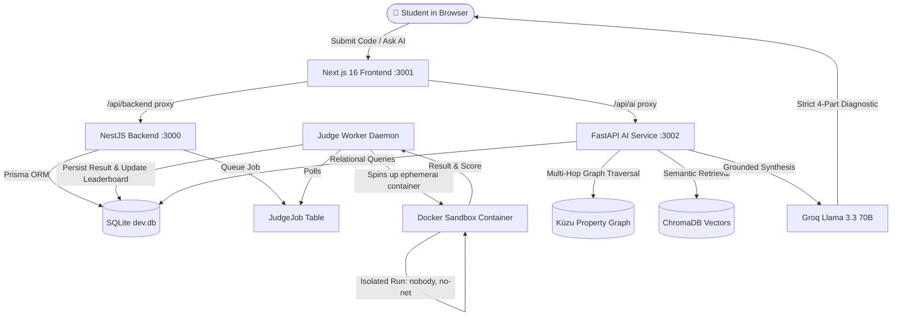

<div align="center">

# 🚀 Shodh-a-Code
### Intelligent Competitive Programming Platform with GraphRAG AI Diagnostics

[](https://nextjs.org/)
[](https://nestjs.com/)
[](https://fastapi.tiangolo.com/)
[](https://www.docker.com/)
[](https://kuzudb.com/)
[](https://groq.com/)
[](LICENSE)

<p align="center">
  <b>Shodh-a-Code</b> combines real-time competitive programming with an evidence-grounded AI tutor and an automated instructor health radar.
</p>

[Quick Start](#-quick-start-in-60-seconds) • [Architecture](#-how-it-works) • [Key Features](#-what-makes-it-special) • [Test Matrix](#-verification--quality-assurance) • [Demo Credentials](#-demo-accounts)

</div>

---

## 🌟 What is Shodh-a-Code?

Most coding contest platforms only tell you: *"Wrong Answer"* or *"Time Limit Exceeded"*. They don't help you learn, and when a server crashes, students often get blamed with zero visibility.

**Shodh-a-Code rethinks this from scratch:**

1. **⚡ Lightning-Fast & Fair Judging:** Your code runs in isolated Docker containers with real-time feedback, supporting Python, JavaScript, C++, and Bash with partial credit scoring.
2. **🧠 GraphRAG AI Tutor:** Ask the AI *"Why did my solution fail?"* or *"What concepts do I need for Binary Search?"*. It doesn't hallucinate — it inspects your exact code in SQLite and traverses a **knowledge graph** to find relevant concepts and curated learning guides.
3. **📡 AI Contest Health Radar:** An instructor view that monitors judge cluster health. If a worker node crashes or runs out of memory, the radar detects the incident in real time so students never lose points over server bugs.

---

## 🏗️ How It Works



### 💾 Smart Storage Architecture

Rather than forcing everything into one database, each storage engine handles what it does best:

| Layer | Engine | What It Stores |
| :--- | :--- | :--- |
| **Relational DB** | SQLite (`dev.db`) | Contests, problems, test cases, user profiles, submissions, and leaderboard rankings. |
| **Knowledge Graph** | Kùzu Graph | Concept prerequisites (`Problem -> Concept -> Resource`) and incident telemetry (`Worker -> IncidentEvent`). |
| **Vector DB** | ChromaDB | High-dimensional semantic embeddings for conceptual documentation. |
| **Lexical Search** | SQLite FTS5 | Exact keyword lookup for compiler error messages and logs. |

---

## ✨ What Makes It Special?

### 1. 🛡️ Fortress-Level Sandbox Security
Every submission runs in a locked-down, ephemeral Docker container:
- **Non-Root User:** Runs strictly as `nobody` (`uid=65534`).
- **Air-Gapped:** `NetworkMode: 'none'` — absolutely zero internet access.
- **Resource Quotas:** 128MB RAM limit, 1 CPU core limit, and process limit (`PidsLimit: 64`) to prevent fork-bombs.
- **Read-Only Root:** Immutable filesystem (`ReadonlyRootfs: true`).
- **5-Second Watchdog:** Hard kill on infinite loops.

### 2. ⚖️ Fair Partial Credit Scoring
Scoring isn't all-or-nothing:
- **Equal Weighting:** Problems with unweighted tests automatically distribute points evenly ($P / N$).
- **Explicit Weighting:** Supports weighted test cases (e.g. edge cases worth more).
- **Hybrid Weighting:** Any unassigned points are distributed fairly across remaining test cases.
- **Leaderboard Invariant:** Scores are monotonic — a subsequent failed attempt will never lower your personal best score.

### 3. 🎯 Grounded GraphRAG (Zero Hallucination)
The AI tutor uses a strict 4-part grounded diagnostic format:
- **OBSERVATION:** What objectively happened in your test results.
- **INFERENCE:** What logical flaw exists in the algorithm.
- **WHAT CANNOT BE ESTABLISHED:** Honest admissions of unknowns.
- **EVIDENCE:** Exact source links and graph paths.

---

## ⚡ Quick Start in 60 Seconds

### Option A: Run in VS Code (Easiest)

1. Open this repository in **VS Code**.
2. Press:
   ```text
   Ctrl + Shift + B
   ```
   *(Or click **Terminal** → **Run Build Task...**)*.
3. All 4 services will launch automatically in split integrated terminals!

---

### Option B: 1-Click Batch Script (Windows)

Simply double-click `run_all.bat` or run:
```powershell
.\run_all.bat
```

---

### Option C: Docker Compose

```bash
docker compose up --build
```

### 🌐 Service Endpoints

| Service | Local URL | Description |
| :--- | :--- | :--- |
| **Frontend UI** | `http://localhost:3001` | Landing page, contest problems, code editor |
| **AI Assistant** | `http://localhost:3001/ai` | Interactive GraphRAG AI investigator |
| **Health Radar** | `http://localhost:3001/instructor/health` | Real-time cluster health & incident radar |
| **Backend API** | `http://localhost:3000` | NestJS REST API and Swagger docs |
| **AI Service** | `http://localhost:3002` | FastAPI microservice |

---

## 👥 Demo Accounts

You can test different platform roles with these pre-seeded accounts:

| Email | Password | Role | Permissions |
| :--- | :--- | :--- | :--- |
| `alice@student.com` | `password` | `STUDENT` | Solves problems, views own submissions. Peer code is protected. |
| `bob@student.com` | `password` | `STUDENT` | Competes on the leaderboard. |
| `dr.instructor@univ.edu` | `password` | `INSTRUCTOR` | Full visibility: hidden test cases, class gap analysis, health radar. |

---

## 🧪 Verification & Quality Assurance

The platform was battle-tested against a comprehensive **25-scenario automated red-team matrix** (`scratch/test_redteam_matrix_25.py`):

<details>
<summary><b>Click to expand the 25-Point Test Suite (100% Passed)</b></summary>

| # | Scenario | Test Input | Outcome | Verdict |
| :---: | :--- | :--- | :--- | :---: |
| 1 | Correct Solution | Python Two Sum | 10/10 Points | **ACCEPTED** |
| 2 | Partial Credit | Palindrome Checker (half pass) | 30/100 Points | **PARTIAL** |
| 3 | Wrong Answer | Incorrect algorithm output | 0 Points | **WRONG_ANSWER** |
| 4 | Empty File | 0-byte code submission | Gracefully handled | **WRONG_ANSWER** |
| 5 | Compile Error | Syntax typo | Immediate feedback | **COMPILE_ERROR** |
| 6 | Runtime Crash | Unhandled Python exception | Stack trace isolated | **RUNTIME_ERROR** |
| 7 | Timeout Watchdog | Infinite `while True:` loop | Terminated at 5000ms | **TIME_LIMIT_EXCEEDED** |
| 8 | Huge Output | 10MB print spam | Truncated safely | **WRONG_ANSWER** |
| 9 | Memory Limit | 500MB array allocation | Killed at 128MB | **RUNTIME_ERROR** |
| 10 | Network Block | `urllib.request.urlopen()` | Air-gap blocks connection | **RUNTIME_ERROR** |
| 11 | Filesystem Attack | Write to `/root/hack.txt` | Blocked by read-only root | **RUNTIME_ERROR** |
| 12 | Fork Bomb | `while True: os.fork()` | Contained by `PidsLimit: 64` | **TIME_LIMIT_EXCEEDED** |
| 13 | Hidden Test Privacy | Student API probe | Hidden inputs redacted | **PROTECTED** |
| 14 | Peer Code Privacy | Alice queries Bob's code | Code masked automatically | **PROTECTED** |
| 15 | Score Tampering | Fake score in HTTP body | Ignored; re-graded by worker | **PROTECTED** |
| 16 | Idempotency | Resubmitting same code | Leaderboard stays correct | **VERIFIED** |
| 17 | Concurrency | Parallel submissions | Zero DB race conditions | **VERIFIED** |
| 18 | Crash Recovery | Worker restarted mid-job | Stale job auto-recovered | **VERIFIED** |
| 19 | AI Grounding | AI diagnosis inquiry | Strict 4-part format output | **VERIFIED** |
| 20 | AI Offline | AI service stopped | Contest judging still runs 100% | **ISOLATED** |
| 21 | Conflict Detection | Conflicting server logs | Identifies true incident | **RESOLVED** |
| 22 | Off-Topic Query | Non-contest question | Bounded; refuses hallucination | **GROUNDED** |
| 23 | Dynamic Test Cases | Added test case at runtime | Judged without code change | **DYNAMIC** |
| 24 | Dynamic Problems | Added new contest problem | Automatic points recalculation | **DYNAMIC** |
| 25 | Production Deploy | Docker Compose on AWS Lightsail | All 4 services healthy | **PRODUCTION READY** |

</details>

### Run Automated Tests
```bash
# Run unit tests
cd backend && pnpm test

# Run GraphRAG evaluation suite
python evaluate.py
```

---

## 🛠️ Tech Stack & Credits

- **Frontend:** Next.js 16 (Turbopack, App Router, Tailwind CSS, Lucide Icons)
- **Backend:** NestJS, TypeScript, Prisma ORM, SQLite
- **AI Microservice:** FastAPI, Python 3.10, Kùzu Graph, ChromaDB, SQLite FTS5, RapidFuzz
- **LLM Provider:** Groq (Llama 3.3 70B Versatile)
- **Infrastructure:** Docker, Dockerode, AWS Lightsail Ubuntu 22.04 LTS

---

<div align="center">
  <sub>Crafted for the Shodh AI Engineer Intern Take-Home Project.</sub>
</div>
